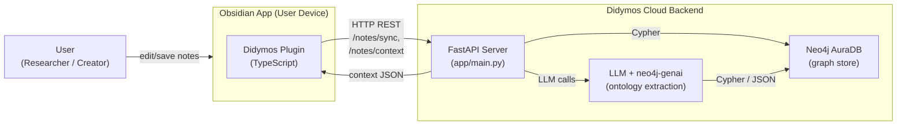
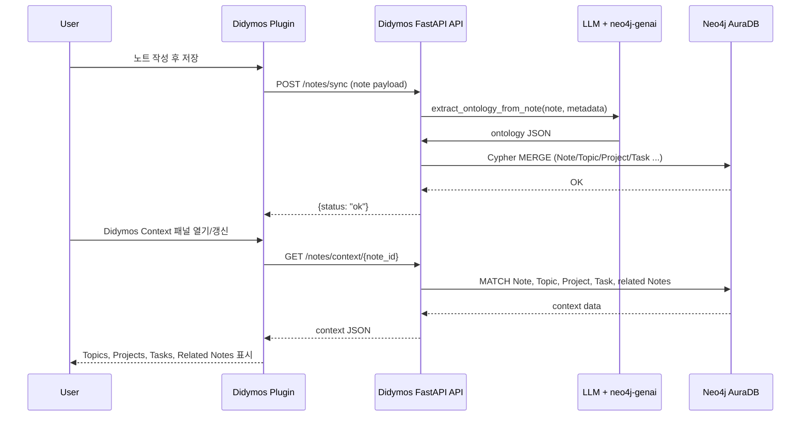

좋지, 이제 전부 **Didymos** 기준으로 갈아끼워볼게요.
(기능은 그대로, 이름/ID/문자열만 MindCompass → Didymos 으로 변경)

---

## 1. 백엔드 코드 뼈대 (Didymos)

### 1-1. 디렉토리 구조

```text
didymos-backend/
  ├─ app/
  │   ├─ main.py
  │   ├─ config.py
  │   ├─ deps.py
  │   ├─ api/
  │   │   ├─ __init__.py
  │   │   ├─ routes_auth.py
  │   │   ├─ routes_notes.py
  │   │   ├─ routes_review.py
  │   ├─ models/
  │   │   ├─ user.py
  │   │   ├─ note.py
  │   ├─ schemas/
  │   │   ├─ auth.py
  │   │   ├─ note.py
  │   │   ├─ context.py
  │   │   ├─ review.py
  │   ├─ services/
  │   │   ├─ ontology.py
  │   │   ├─ llm_client.py
  │   ├─ db/
  │       ├─ neo4j.py
  │       ├─ postgres.py
  ├─ requirements.txt
  ├─ Dockerfile
  └─ docker-compose.yml
```

---

### 1-2. `config.py`

```python
# app/config.py
from pydantic import BaseSettings


class Settings(BaseSettings):
    # FastAPI
    app_name: str = "Didymos API"
    api_prefix: str = "/api/v1"

    # Neo4j
    neo4j_uri: str
    neo4j_user: str
    neo4j_password: str

    # OpenAI
    openai_api_key: str

    # 기타
    env: str = "dev"

    class Config:
        env_file = ".env"


settings = Settings()
```

---

### 1-3. `db/neo4j.py`

```python
# app/db/neo4j.py
from neo4j import GraphDatabase
from app.config import settings

_driver = None


def get_neo4j_driver():
    global _driver
    if _driver is None:
        _driver = GraphDatabase.driver(
            settings.neo4j_uri,
            auth=(settings.neo4j_user, settings.neo4j_password),
        )
    return _driver


def close_neo4j_driver():
    global _driver
    if _driver is not None:
        _driver.close()
        _driver = None
```

---

### 1-4. `schemas/note.py`, `schemas/context.py`

```python
# app/schemas/note.py
from typing import List, Optional, Dict, Any
from pydantic import BaseModel


class NotePayload(BaseModel):
    note_id: str
    title: str
    path: str
    content: Optional[str] = None
    yaml: Dict[str, Any] = {}
    tags: List[str] = []
    links: List[str] = []
    created_at: str
    updated_at: str


class NoteSyncRequest(BaseModel):
    user_token: str
    vault_id: str
    note: NotePayload
```

```python
# app/schemas/context.py
from typing import List
from pydantic import BaseModel


class TopicOut(BaseModel):
    id: str
    name: str


class ProjectOut(BaseModel):
    id: str
    name: str


class TaskOut(BaseModel):
    id: str
    title: str
    status: str


class RelatedNoteOut(BaseModel):
    note_id: str
    title: str
    path: str


class NoteContextResponse(BaseModel):
    topics: List[TopicOut]
    projects: List[ProjectOut]
    tasks: List[TaskOut]
    related_notes: List[RelatedNoteOut]
```

---

### 1-5. `services/llm_client.py`

```python
# app/services/llm_client.py
from typing import Dict, Any
import json
import openai
from app.config import settings

openai.api_key = settings.openai_api_key

EXTRACTION_SYSTEM_PROMPT = """You are an ontology extractor for personal knowledge management.
From the note below, extract:
1) Topics
2) Projects
3) Tasks
4) Persons
5) Relations between topics (broader/narrower/related).
Output JSON only with keys: topics, projects, tasks, persons, relations.
"""


def extract_ontology_from_note(note_text: str, metadata: Dict[str, Any]) -> Dict[str, Any]:
    user_content = f"Note:\n{note_text}\n\nMetadata:\n{metadata}"
    resp = openai.ChatCompletion.create(
        model="gpt-4.1-mini",
        messages=[
            {"role": "system", "content": EXTRACTION_SYSTEM_PROMPT},
            {"role": "user", "content": user_content},
        ],
    )
    raw = resp["choices"][0]["message"]["content"]
    return json.loads(raw)
```

---

### 1-6. `services/ontology.py`

```python
# app/services/ontology.py
from typing import Dict, Any
from neo4j import Driver
from app.services.llm_client import extract_ontology_from_note


def upsert_note_ontology(
    driver: Driver,
    user_id: str,
    vault_id: str,
    note_payload: Dict[str, Any],
) -> None:
    """
    1) LLM으로 엔티티/관계 추출
    2) Neo4j에 MERGE
    """
    content = note_payload.get("content") or ""
    metadata = {
        "yaml": note_payload.get("yaml", {}),
        "tags": note_payload.get("tags", []),
        "links": note_payload.get("links", []),
    }

    ontology = extract_ontology_from_note(content, metadata)

    note_id = note_payload["note_id"]
    title = note_payload["title"]
    path = note_payload["path"]

    with driver.session() as session:
        session.run(
            """
            MERGE (u:User {id: $user_id})
            MERGE (v:Vault {id: $vault_id})-[:OWNED_BY]->(u)
            MERGE (n:Note {note_id: $note_id})
              ON CREATE SET n.title = $title, n.path = $path
              ON MATCH SET  n.title = $title, n.path = $path
            MERGE (v)-[:HAS_NOTE]->(n)
            """,
            user_id=user_id,
            vault_id=vault_id,
            note_id=note_id,
            title=title,
            path=path,
        )

        # TODO: ontology["topics"], ["projects"], ["tasks"], ["relations"]
        # 를 이용해 Topic, Project, Task 노드 및 관계 MERGE
```

---

### 1-7. `api/routes_notes.py`

```python
# app/api/routes_notes.py
from fastapi import APIRouter
from app.schemas.note import NoteSyncRequest
from app.schemas.context import NoteContextResponse
from app.db.neo4j import get_neo4j_driver
from app.services.ontology import upsert_note_ontology

router = APIRouter(prefix="/notes", tags=["notes"])


def get_current_user_id_from_token(token: str) -> str:
    # TODO: JWT 검증 후 user_id 반환 (MVP에서는 토큰을 user_id로 사용)
    return token


@router.post("/sync")
def sync_note(payload: NoteSyncRequest):
    driver = get_neo4j_driver()
    user_id = get_current_user_id_from_token(payload.user_token)

    upsert_note_ontology(
        driver=driver,
        user_id=user_id,
        vault_id=payload.vault_id,
        note_payload=payload.note.dict(exclude_none=True),
    )

    return {"status": "ok"}


@router.get("/context/{note_id}", response_model=NoteContextResponse)
def get_note_context(note_id: str, user_token: str):
    driver = get_neo4j_driver()
    user_id = get_current_user_id_from_token(user_token)

    # TODO: Neo4j에서 context 조회
    return NoteContextResponse(
        topics=[{"id": "T1", "name": "Raman scattering"}],
        projects=[{"id": "P1", "name": "Symbiotic star monitoring"}],
        tasks=[{"id": "TASK1", "title": "Check RR Tel spectra", "status": "todo"}],
        related_notes=[
            {
                "note_id": "2024-10-10-rr-tel.md",
                "title": "RR Tel ideas",
                "path": "Research/Raman/2024-10-10-rr-tel.md",
            }
        ],
    )
```

---

### 1-8. `main.py`

```python
# app/main.py
from fastapi import FastAPI
from fastapi.middleware.cors import CORSMiddleware

from app.config import settings
from app.api import routes_notes
from app.db.neo4j import close_neo4j_driver

app = FastAPI(title=settings.app_name)

app.add_middleware(
    CORSMiddleware,
    allow_origins=["*"],  # MVP 단계에서는 * 허용, 나중에 제한
    allow_credentials=True,
    allow_methods=["*"],
    allow_headers=["*"],
)

app.include_router(routes_notes.router, prefix=settings.api_prefix)


@app.get("/health")
def health_check():
    return {"status": "ok"}


@app.on_event("shutdown")
def shutdown_event():
    close_neo4j_driver()
```

---

## 2. Obsidian 플러그인 뼈대 (Didymos)

### 2-1. 디렉토리 구조

```text
didymos-obsidian/
  ├─ main.ts
  ├─ manifest.json
  ├─ styles.css
  └─ src/
      ├─ settings.ts
      ├─ api.ts
      └─ views/
          └─ contextView.ts
```

---

### 2-2. `manifest.json`

```json
{
  "id": "didymos-plugin",
  "name": "Didymos",
  "version": "0.1.0",
  "minAppVersion": "1.5.0",
  "description": "Ontology-based knowledge graph and productivity engine powered by Didymos Cloud.",
  "author": "PhD. Shin",
  "authorUrl": "https://example.com",
  "isDesktopOnly": false
}
```

---

### 2-3. `src/settings.ts`

```ts
// src/settings.ts
export interface DidymosSettings {
  apiBaseUrl: string;
  userToken: string;
  vaultId: string;
  autoSyncOnSave: boolean;
  privacyMode: "full" | "summary" | "metadata";
}

export const DEFAULT_SETTINGS: DidymosSettings = {
  apiBaseUrl: "http://localhost:8000/api/v1",
  userToken: "",
  vaultId: "default-vault",
  autoSyncOnSave: true,
  privacyMode: "full",
};
```

---

### 2-4. `src/api.ts`

```ts
// src/api.ts
import { DidymosSettings } from "./settings";

export async function syncNote(
  settings: DidymosSettings,
  note: {
    note_id: string;
    title: string;
    path: string;
    content: string;
    yaml: any;
    tags: string[];
    links: string[];
    created_at: string;
    updated_at: string;
  }
): Promise<void> {
  const payload = {
    user_token: settings.userToken,
    vault_id: settings.vaultId,
    note,
  };

  await fetch(`${settings.apiBaseUrl}/notes/sync`, {
    method: "POST",
    headers: {
      "Content-Type": "application/json",
    },
    body: JSON.stringify(payload),
  });
}

export async function fetchContext(
  settings: DidymosSettings,
  noteId: string
) {
  const url = new URL(
    `${settings.apiBaseUrl}/notes/context/${encodeURIComponent(noteId)}`
  );
  url.searchParams.set("user_token", settings.userToken);

  const res = await fetch(url.toString());
  if (!res.ok) throw new Error("Failed to fetch context");
  return res.json();
}
```

---

### 2-5. `src/views/contextView.ts`

```ts
// src/views/contextView.ts
import { ItemView, WorkspaceLeaf } from "obsidian";
import { DidymosSettings } from "../settings";
import { fetchContext } from "../api";

export const CAIRN_VIEW_TYPE = "didymos-context-view";

export class DidymosContextView extends ItemView {
  settings: DidymosSettings;

  constructor(leaf: WorkspaceLeaf, settings: DidymosSettings) {
    super(leaf);
    this.settings = settings;
  }

  getViewType(): string {
    return CAIRN_VIEW_TYPE;
  }

  getDisplayText(): string {
    return "Didymos Context";
  }

  async onOpen() {
    const container = this.containerEl.children[1];
    container.empty();
    container.createEl("h2", { text: "Didymos Context" });
    container.createEl("p", {
      text: "현재 노트를 저장하면 여기 컨텍스트 정보가 표시됩니다.",
    });
  }

  async updateContextForNote(noteId: string) {
    const container = this.containerEl.children[1];
    container.empty();
    container.createEl("h2", { text: "Didymos Context" });

    try {
      const ctx = await fetchContext(this.settings, noteId);

      const topics = container.createEl("div");
      topics.createEl("h3", { text: "Topics" });
      const ulT = topics.createEl("ul");
      ctx.topics.forEach((t: any) => ulT.createEl("li", { text: t.name }));

      const projects = container.createEl("div");
      projects.createEl("h3", { text: "Projects" });
      const ulP = projects.createEl("ul");
      ctx.projects.forEach((p: any) => ulP.createEl("li", { text: p.name }));

      const tasks = container.createEl("div");
      tasks.createEl("h3", { text: "Tasks" });
      const ulTask = tasks.createEl("ul");
      ctx.tasks.forEach((task: any) =>
        ulTask.createEl("li", { text: `${task.title} [${task.status}]` })
      );

      const rel = container.createEl("div");
      rel.createEl("h3", { text: "Related Notes" });
      const ulR = rel.createEl("ul");
      ctx.related_notes.forEach((n: any) =>
        ulR.createEl("li", { text: `${n.title} (${n.path})` })
      );
    } catch (e) {
      container.createEl("p", {
        text: "컨텍스트 불러오기 실패: " + (e as Error).message,
      });
    }
  }
}
```

---

### 2-6. `main.ts` (플러그인 엔트리)

```ts
// main.ts
import {
  App,
  Plugin,
  PluginSettingTab,
  Setting,
  TFile,
  WorkspaceLeaf,
} from "obsidian";
import { DidymosSettings, DEFAULT_SETTINGS } from "./src/settings";
import { syncNote } from "./src/api";
import {
  DidymosContextView,
  CAIRN_VIEW_TYPE,
} from "./src/views/contextView";

export default class DidymosPlugin extends Plugin {
  settings: DidymosSettings;

  async onload() {
    console.log("Loading Didymos plugin");
    await this.loadSettings();

    this.registerView(
      CAIRN_VIEW_TYPE,
      (leaf: WorkspaceLeaf) => new DidymosContextView(leaf, this.settings)
    );

    this.addRibbonIcon("mountain", "Open Didymos Context", () => {
      this.activateView();
    });

    this.addCommand({
      id: "didymos-sync-current-note",
      name: "Sync current note to Didymos",
      callback: () => this.syncCurrentNote(),
    });

    if (this.settings.autoSyncOnSave) {
      this.registerEvent(
        this.app.vault.on("modify", (file) => {
          if (file instanceof TFile && file.extension === "md") {
            this.syncNoteFile(file);
          }
        })
      );
    }

    this.addSettingTab(new DidymosSettingTab(this.app, this));
  }

  onunload() {
    console.log("Unloading Didymos plugin");
    this.app.workspace
      .getLeavesOfType(CAIRN_VIEW_TYPE)
      .forEach((leaf) => leaf.detach());
  }

  async activateView() {
    const { workspace } = this.app;
    let leaf = workspace.getLeavesOfType(CAIRN_VIEW_TYPE)[0];
    if (!leaf) {
      leaf = workspace.getRightLeaf(false);
      await leaf.setViewState({
        type: CAIRN_VIEW_TYPE,
        active: true,
      });
    }
    workspace.revealLeaf(leaf);
  }

  async syncCurrentNote() {
    const file = this.app.workspace.getActiveFile();
    if (!file) return;
    await this.syncNoteFile(file);
  }

  async syncNoteFile(file: TFile) {
    const content = await this.app.vault.read(file);
    const cache = this.app.metadataCache.getFileCache(file);

    const yaml = cache?.frontmatter ?? {};
    const tags = (cache?.tags ?? []).map((t) => t.tag.replace("#", ""));
    const links = cache?.links?.map((l) => l.link) ?? [];

    const notePayload = {
      note_id: file.path,
      title: file.basename,
      path: file.path,
      content,
      yaml,
      tags,
      links,
      created_at: file.stat.ctime.toString(),
      updated_at: file.stat.mtime.toString(),
    };

    await syncNote(this.settings, notePayload);

    const leaf = this.app.workspace.getLeavesOfType(CAIRN_VIEW_TYPE)[0];
    if (leaf && leaf.view instanceof DidymosContextView) {
      await (leaf.view as DidymosContextView).updateContextForNote(
        notePayload.note_id
      );
    }
  }

  async loadSettings() {
    this.settings = Object.assign(
      {},
      DEFAULT_SETTINGS,
      await this.loadData()
    );
  }

  async saveSettings() {
    await this.saveData(this.settings);
  }
}

class DidymosSettingTab extends PluginSettingTab {
  plugin: DidymosPlugin;

  constructor(app: App, plugin: DidymosPlugin) {
    super(app, plugin);
    this.plugin = plugin;
  }

  display(): void {
    const { containerEl } = this;
    containerEl.empty();
    containerEl.createEl("h2", {
      text: "Didymos 설정",
    });

    new Setting(containerEl)
      .setName("API Base URL")
      .setDesc("Didymos 백엔드 주소")
      .addText((text) =>
        text
          .setValue(this.plugin.settings.apiBaseUrl)
          .onChange(async (value) => {
            this.plugin.settings.apiBaseUrl = value;
            await this.plugin.saveSettings();
          })
      );

    new Setting(containerEl)
      .setName("User Token")
      .setDesc("임시 user_token (추후 로그인 UI로 대체)")
      .addText((text) =>
        text
          .setValue(this.plugin.settings.userToken)
          .onChange(async (value) => {
            this.plugin.settings.userToken = value;
            await this.plugin.saveSettings();
          })
      );

    new Setting(containerEl)
      .setName("Vault ID")
      .setDesc("이 Obsidian vault를 구분할 ID")
      .addText((text) =>
        text
          .setValue(this.plugin.settings.vaultId)
          .onChange(async (value) => {
            this.plugin.settings.vaultId = value;
            await this.plugin.saveSettings();
          })
      );

    new Setting(containerEl)
      .setName("Auto sync on save")
      .setDesc("노트 저장 시 자동으로 Didymos에 동기화")
      .addToggle((toggle) =>
        toggle
          .setValue(this.plugin.settings.autoSyncOnSave)
          .onChange(async (value) => {
            this.plugin.settings.autoSyncOnSave = value;
            await this.plugin.saveSettings();
          })
      );
  }
}
```

---

## 3. 아키텍처 다이어그램 (Didymos 버전)

### 3-1. 컴포넌트 다이어그램 (Mermaid)



### 3-2. 시퀀스 다이어그램



---
