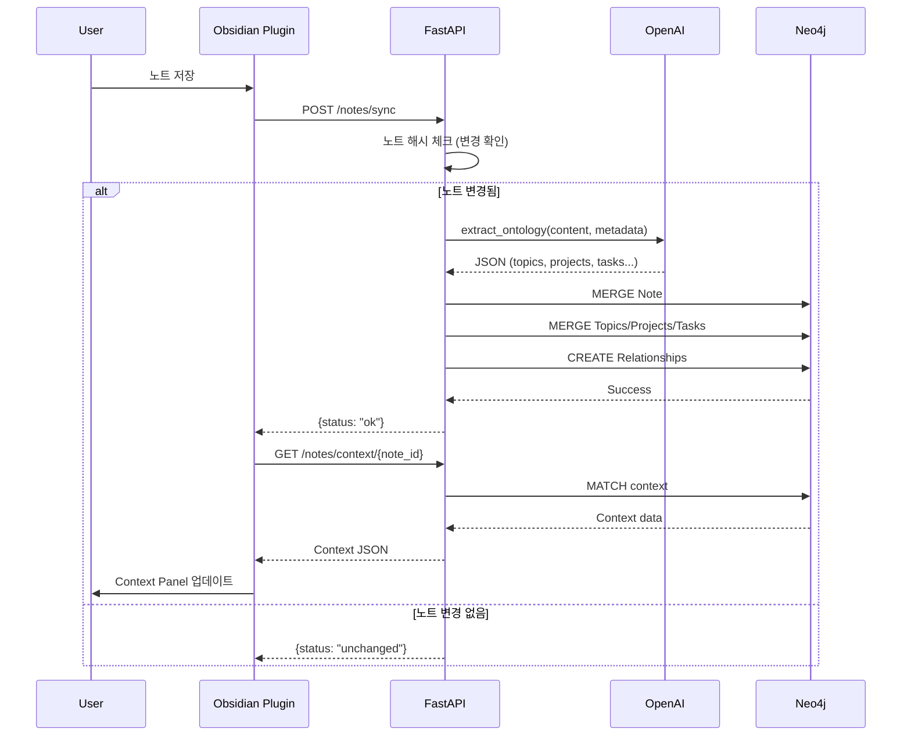

# 🏗️ Didymos - Information Architecture

> 시스템의 정보 구조, 데이터 모델, API 명세

---

## 1. 시스템 구조도

```
┌──────────────────────────────────────────┐
│          Obsidian Client                  │
│  ┌────────────────────────────────────┐  │
│  │      Didymos Plugin (TypeScript)      │  │
│  │  - Context View                     │  │
│  │  - Graph View                       │  │
│  │  - Task View                        │  │
│  │  - Settings                         │  │
│  └────────────────────────────────────┘  │
└──────────────┬───────────────────────────┘
               │ HTTPS/REST
┌──────────────▼───────────────────────────┐
│          FastAPI Backend                  │
│  ┌────────────────────────────────────┐  │
│  │  Routes                            │  │
│  │  - /auth                           │  │
│  │  - /notes                          │  │
│  │  - /review                         │  │
│  │  - /tasks                          │  │
│  ├────────────────────────────────────┤  │
│  │  Services                          │  │
│  │  - ontology.py (LLM 추출)         │  │
│  │  - llm_client.py (OpenAI)         │  │
│  │  - graph_analyzer.py              │  │
│  └────────────────────────────────────┘  │
└──────────────┬───────────────────────────┘
               │ Cypher
┌──────────────▼───────────────────────────┐
│         Neo4j AuraDB                      │
│  - User/Vault/Note 노드                   │
│  - Topic/Project/Task/Person 노드          │
│  - 관계: MENTIONS, RELATES_TO, etc.       │
└───────────────────────────────────────────┘
```

---

## 2. 데이터 모델 (Neo4j Graph Schema)

### 2.1 노드 타입 및 속성

#### User
```cypher
(:User {
  id: String,              // 고유 사용자 ID
  email: String,           // 이메일
  created_at: DateTime,    // 가입일
  subscription: String     // "free" | "pro" | "power"
})
```

#### Vault
```cypher
(:Vault {
  id: String,              // Vault ID
  name: String,            // Vault 이름
  created_at: DateTime,
  last_synced: DateTime
})
```

#### Note
```cypher
(:Note {
  note_id: String,         // 파일 경로 (unique)
  title: String,           // 노트 제목
  path: String,            // 파일 경로
  content_hash: String,    // 내용 해시 (변경 감지)
  tags: List<String>,      // 태그 목록
  created_at: DateTime,
  updated_at: DateTime,
  embedding: Vector        // (Optional) 벡터 임베딩
})
```

#### Topic
```cypher
(:Topic {
  id: String,              // 자동 생성 ID
  name: String,            // 토픽 이름
  description: String,     // LLM 생성 설명
  importance_score: Float, // 0.0~1.0
  first_seen: DateTime,
  last_mentioned: DateTime,
  mention_count: Integer
})
```

#### Project
```cypher
(:Project {
  id: String,
  name: String,
  status: String,          // "active" | "paused" | "done"
  description: String,
  created_at: DateTime,
  updated_at: DateTime,
  deadline: DateTime       // (Optional)
})
```

#### Task
```cypher
(:Task {
  id: String,
  title: String,
  status: String,          // "todo" | "in_progress" | "done"
  priority: String,        // "low" | "medium" | "high"
  due_date: DateTime,      // (Optional)
  created_at: DateTime,
  completed_at: DateTime   // (Optional)
})
```

#### Person
```cypher
(:Person {
  id: String,
  name: String,
  role: String,            // "colleague" | "author" | etc.
  first_mentioned: DateTime
})
```

---

### 2.2 관계 (Relationships)

#### User ↔ Vault
```cypher
(:User)-[:OWNS {created_at: DateTime}]->(:Vault)
```

#### Vault ↔ Note
```cypher
(:Vault)-[:HAS_NOTE {synced_at: DateTime}]->(:Note)
```

#### Note ↔ Topic
```cypher
(:Note)-[:MENTIONS {
  confidence: Float,       // 0.0~1.0 (LLM 추출 신뢰도)
  extracted_at: DateTime
}]->(:Topic)
```

#### Note ↔ Project
```cypher
(:Note)-[:RELATES_TO_PROJECT {
  relevance: Float,
  extracted_at: DateTime
}]->(:Project)
```

#### Note ↔ Task
```cypher
(:Note)-[:CONTAINS_TASK {
  line_number: Integer,    // 노트 내 위치
  extracted_at: DateTime
}]->(:Task)
```

#### Note ↔ Person
```cypher
(:Note)-[:MENTIONS_PERSON {
  context: String,         // 언급 문맥
  extracted_at: DateTime
}]->(:Person)
```

#### Topic ↔ Topic
```cypher
(:Topic)-[:BROADER]->(:Topic)        // 상위 개념
(:Topic)-[:NARROWER]->(:Topic)       // 하위 개념
(:Topic)-[:RELATED {
  strength: Float          // 연관 강도
}]->(:Topic)
```

#### Project ↔ Task
```cypher
(:Project)-[:HAS_TASK {
  order: Integer           // Task 순서
}]->(:Task)
```

#### Project ↔ Topic
```cypher
(:Project)-[:HAS_TOPIC]->(:Topic)
```

#### Note ↔ Note (Internal Links)
```cypher
(:Note)-[:LINKS_TO {
  link_text: String,       // 링크 텍스트
  created_at: DateTime
}]->(:Note)
```

---

## 3. API 명세

### 3.1 인증 (Authentication)

#### POST `/auth/register`
**요청**
```json
{
  "email": "user@example.com",
  "password": "secure_password"
}
```
**응답**
```json
{
  "user_id": "user_123",
  "token": "jwt_token_here"
}
```

#### POST `/auth/login`
**요청**
```json
{
  "email": "user@example.com",
  "password": "secure_password"
}
```
**응답**
```json
{
  "token": "jwt_token_here",
  "user_id": "user_123"
}
```

---

### 3.2 노트 동기화

#### POST `/notes/sync`
**요청**
```json
{
  "user_token": "jwt_token",
  "vault_id": "vault_001",
  "note": {
    "note_id": "research/raman-scattering.md",
    "title": "Raman Scattering",
    "path": "research/raman-scattering.md",
    "content": "# Raman Scattering\n...",
    "yaml": {
      "date": "2024-01-15",
      "tags": ["physics", "spectroscopy"]
    },
    "tags": ["physics", "spectroscopy"],
    "links": ["research/heil-line.md"],
    "created_at": "2024-01-15T10:00:00Z",
    "updated_at": "2024-01-15T15:30:00Z"
  }
}
```
**응답**
```json
{
  "status": "ok",
  "note_id": "research/raman-scattering.md",
  "entities_extracted": {
    "topics": 3,
    "projects": 1,
    "tasks": 2
  }
}
```

---

### 3.3 컨텍스트 조회

#### GET `/notes/context/{note_id}`
**쿼리 파라미터**
- `user_token`: JWT 토큰

**응답**
```json
{
  "topics": [
    {
      "id": "topic_123",
      "name": "Raman scattering",
      "importance_score": 0.85
    }
  ],
  "projects": [
    {
      "id": "proj_456",
      "name": "Symbiotic star monitoring",
      "status": "active"
    }
  ],
  "tasks": [
    {
      "id": "task_789",
      "title": "Analyze RR Tel spectra",
      "status": "todo",
      "priority": "high"
    }
  ],
  "related_notes": [
    {
      "note_id": "research/heil-line.md",
      "title": "HeII Line Analysis",
      "path": "research/heil-line.md",
      "similarity": 0.78
    }
  ]
}
```

---

### 3.4 그래프 데이터

#### GET `/notes/graph/{note_id}`
**쿼리 파라미터**
- `user_token`: JWT 토큰
- `hops`: 1 또는 2 (기본값: 1)

**응답**
```json
{
  "nodes": [
    {
      "id": "note_001",
      "type": "Note",
      "label": "Raman Scattering",
      "properties": {"path": "research/raman.md"}
    },
    {
      "id": "topic_123",
      "type": "Topic",
      "label": "Raman scattering",
      "properties": {"importance_score": 0.85}
    }
  ],
  "edges": [
    {
      "source": "note_001",
      "target": "topic_123",
      "type": "MENTIONS",
      "properties": {"confidence": 0.92}
    }
  ]
}
```

---

### 3.5 주간 리뷰

#### GET `/review/weekly`
**쿼리 파라미터**
- `user_token`: JWT 토큰
- `vault_id`: Vault ID

**응답**
```json
{
  "new_topics": [
    {"name": "Quantum computing", "mention_count": 5}
  ],
  "forgotten_projects": [
    {
      "name": "ML Paper Review",
      "last_updated": "2024-01-01",
      "days_inactive": 14
    }
  ],
  "pending_tasks": [
    {
      "title": "Finish literature review",
      "priority": "high",
      "overdue_by_days": 3
    }
  ],
  "most_active_notes": [
    {
      "title": "Daily Notes",
      "update_count": 15
    }
  ]
}
```

---

### 3.6 Task 관리

#### PUT `/tasks/update`
**요청**
```json
{
  "user_token": "jwt_token",
  "task_id": "task_789",
  "updates": {
    "status": "done",
    "completed_at": "2024-01-20T14:00:00Z"
  }
}
```
**응답**
```json
{
  "status": "ok",
  "task_id": "task_789"
}
```

---

## 4. 데이터 흐름 (Data Flow)

### 4.1 노트 동기화 플로우



---

### 4.2 컨텍스트 생성 로직

```python
def get_note_context(note_id: str, user_id: str) -> Dict:
    """
    Neo4j Cypher 쿼리를 통해 노트 컨텍스트 생성
    """
    # 1. 직접 연결된 Topics
    topics = get_topics_for_note(note_id)
    
    # 2. 관련 Projects
    projects = get_projects_for_note(note_id)
    
    # 3. 포함된 Tasks
    tasks = get_tasks_in_note(note_id)
    
    # 4. 유사한 노트 (Topic 기반)
    related_notes = find_similar_notes(note_id, limit=5)
    
    return {
        "topics": topics,
        "projects": projects,
        "tasks": tasks,
        "related_notes": related_notes
    }
```

**Cypher 쿼리 예시**
```cypher
// 관련 노트 찾기 (공통 Topic 기반)
MATCH (n:Note {note_id: $note_id})-[:MENTIONS]->(t:Topic)<-[:MENTIONS]-(related:Note)
WHERE n <> related
WITH related, COUNT(t) as common_topics
ORDER BY common_topics DESC
LIMIT 5
RETURN related.note_id, related.title, related.path, common_topics
```

---

## 5. 확장 가능성

### 5.1 향후 추가 노드
- `(:Meeting)` - 회의 노트 특화
- `(:Reference)` - 논문/책 참조
- `(:Insight)` - 중요한 인사이트 자동 추출

### 5.2 향후 추가 관계
- `(:Topic)-[:EVOLVES_TO]->(:Topic)` - 개념 진화
- `(:Note)-[:CONTRADICTS]->(:Note)` - 모순 감지
- `(:Project)-[:DEPENDS_ON]->(:Project)` - 프로젝트 의존성

### 5.3 벡터 검색 통합
```cypher
// Neo4j Vector Index 활용
CALL db.index.vector.queryNodes(
  'note_embeddings', 
  $query_vector, 
  10
) YIELD node, score
RETURN node.title, node.path, score
```

---

## 6. 성능 최적화

### 6.1 인덱스 전략
```cypher
// Note 검색 최적화
CREATE INDEX note_id_idx FOR (n:Note) ON (n.note_id);
CREATE INDEX note_updated_idx FOR (n:Note) ON (n.updated_at);

// Topic 검색 최적화
CREATE INDEX topic_name_idx FOR (t:Topic) ON (t.name);
CREATE FULLTEXT INDEX topic_description FOR (t:Topic) ON EACH [t.description];

// Project 상태별 조회
CREATE INDEX project_status_idx FOR (p:Project) ON (p.status);
```

### 6.2 캐싱 전략
- Redis 캐시: Context API 응답 (TTL: 5분)
- 로컬 캐시: 플러그인에서 최근 조회 노트 (메모리)

---

이 IA 문서는 개발자가 시스템을 구현할 때 필요한 모든 정보 구조를 담고 있습니다.
